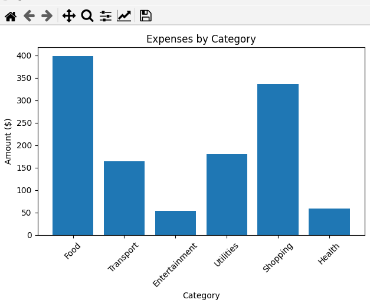
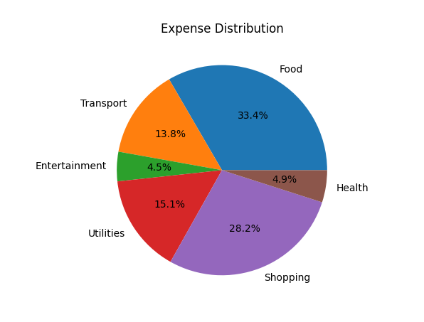

# 💸 Sheety Expense Tracker

A simple yet powerful **CLI-based expense tracking tool** using:

- Google Sheets as a database  
- Sheety as an API layer  
- Python for analytics and automation  

---

## 🚀 Features

- ✅ Add expenses from the command line  
- ✅ View total spending  
- ✅ Track daily and monthly expenses  
- ✅ Category-wise breakdown  
- ✅ Identify top spending category  
- ✅ Generate charts (bar + pie)  
- ✅ Save charts as image files  

---

## 🧱 Tech Stack

- Python  
- Requests (API calls)  
- python-dotenv (environment variables)  
- Matplotlib (visualization)  
- Google Sheets (data storage)  
- Sheety API (REST interface)

---

## 📁 Project Structure

```
sheety-expense-tracker/
│
├── expense_cli.py        # CLI interface
├── expense_service.py    # Business logic
├── .env                  # API credentials (not committed)
├── requirements.txt
└── README.md
```

---

## ⚙️ Setup Instructions

### 1. Clone the repository

```bash
git clone https://github.com/your-username/sheety-expense-tracker.git
cd sheety-expense-tracker
```

---

### 2. Install dependencies

```bash
pip install -r requirements.txt
```

---

### 3. Configure environment variables

Create a `.env` file:

```env
SHEETY_ENDPOINT=https://api.sheety.co/your-project/expenses/expenses
SHEETY_USERNAME=your_username
SHEETY_PASSWORD=your_password
```

---

## ▶️ Usage

### 🔹 Add Expense

```bash
python expense_cli.py add "coffee" 5 Food
```

---

### 🔹 View Summary

```bash
python expense_cli.py summary
```

---

### 🔹 Today's Spending

```bash
python expense_cli.py today
```

---

### 🔹 Current Month

```bash
python expense_cli.py month
```

---

### 🔹 Daily Breakdown

```bash
python expense_cli.py daily
```

---

## 📊 Charts

#### Bar Chart

```bash
python expense_cli.py chart
```
## 📊 Sample Chart

A sample bar chart generated by the CLI:



#### Pie Chart

```bash
python expense_cli.py pie
```
## 📊 Sample Chart
### Pie Chart — Expense Distribution
A visual breakdown of each category’s percentage of total spending.




#### Save Chart as Image

```bash
python expense_cli.py save
```

---

## 📊 Example Output

```
=== SUMMARY ===
Total spent: $1186.45
Current month total: $320.00

Top spending category: Food ($392.70)

=== BY CATEGORY ===
Food: $392.70
Shopping: $335.97
Utilities: $180.50
...
```

---

## 🧠 How It Works

1. Expenses are stored in Google Sheets  
2. Sheety converts the sheet into a REST API  
3. Python fetches and processes the data  
4. CLI displays analytics and charts  

---

## 🔒 Security Note

- `.env` file is ignored via `.gitignore`  
- Never commit API credentials  

---

## 🚀 Future Improvements

- [ ] Auto-categorization of expenses  
- [ ] Edit / delete expenses  
- [ ] Web dashboard (Flask or Streamlit)  
- [ ] Export to CSV / PDF  
- [ ] Budget alerts  

---

## 🤝 Contributing

Pull requests are welcome. For major changes, please open an issue first.

---

## 📄 License

This project is open-source and available under the MIT License.

---

## ⭐ Acknowledgements

- Sheety API  
- Google Sheets  
- Python community  
```

---

